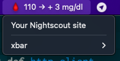

# Xbar plugin for Nightscout



This is an [xbar](https://xbarapp.com/) plugin to show your BG levels in your OSX menu bar.

It's inspired on [NightscoutBitBar](https://github.com/jhaydraude/NightscoutBitBar/).

To make it work with your Nightscout site, you'll have to edit the `nightscout.1m.rb` file before
moving it to the xbar plugins directory and change the lines 15 and 16 with your own data.

`MY_DOMAIN` must be changed to your Nightscout site name. If your Nightscout url is:
`https://jane-doe.herokuapp.com/` it should look like this:

```ruby
MY_DOMAIN = 'jane-doe'
```

`MY_TOKEN` must contain the token for the role with read access to the API. Check [here](https://nightscout.github.io/nightscout/security/#create-a-token)
the Nightscout docs on how to create an access token.

### Coming soon

- Support for mmol units

- Support for Nightscout sites outside of Heroku.

- Different emojis based on user configurable limits.

- Sound alerts (if supported by xbar)
